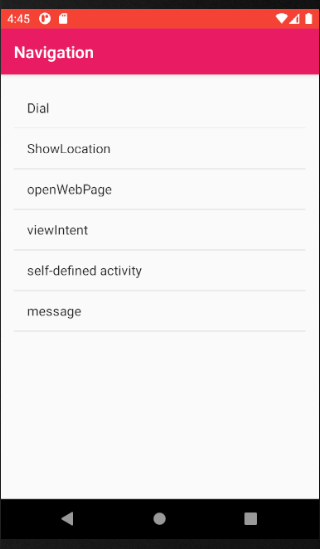
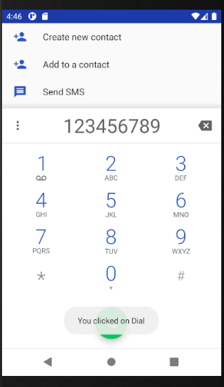
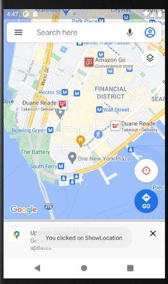
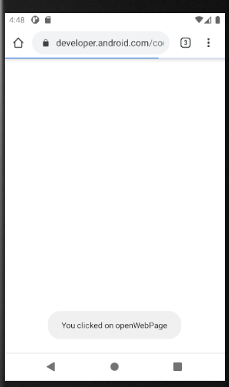
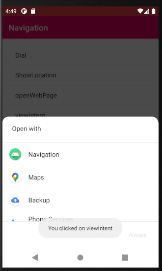
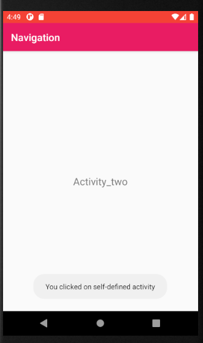
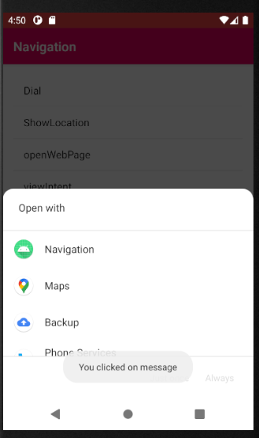

# Android Navigation App
### A navigation app to meet user's general needs, including dialing, messaging, locating, and using browser, etc.

### author: Yi Rong
### date: 07/11/21
---
### 1. Main Interface

### 2. Dial

### 3. Show Location

### 4. Open Web Page

### 5. Open other Apps

### 6. Self-defined page

### 7. Message

